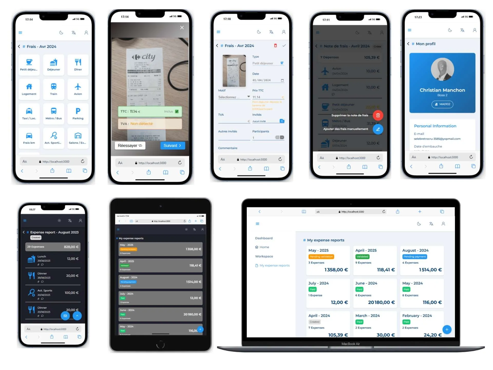
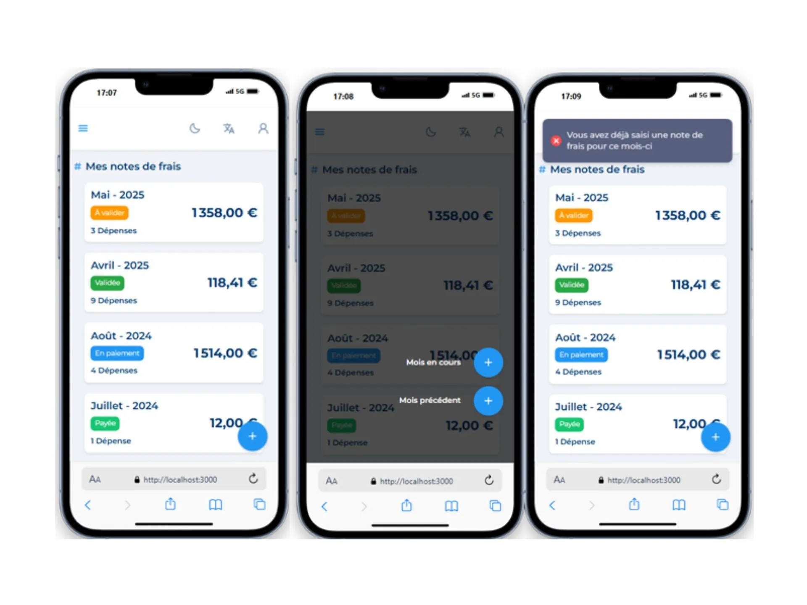
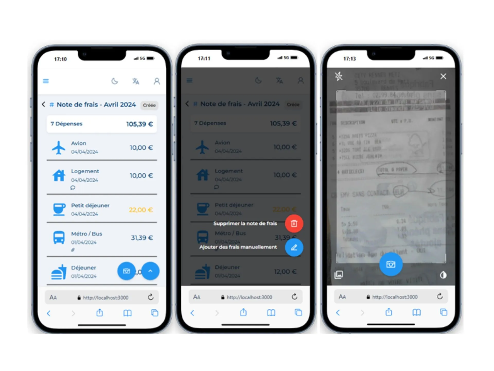
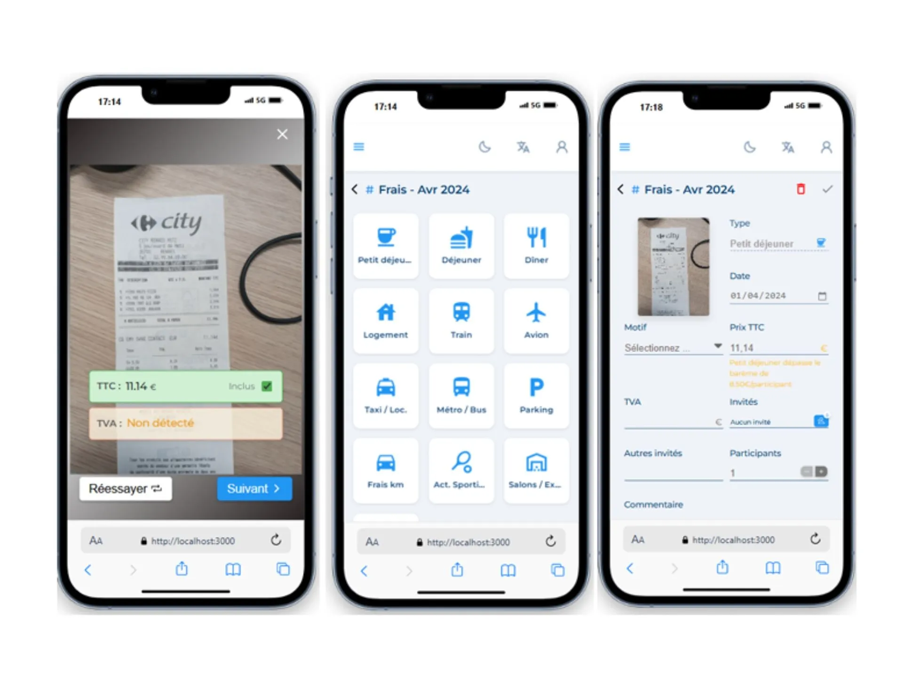
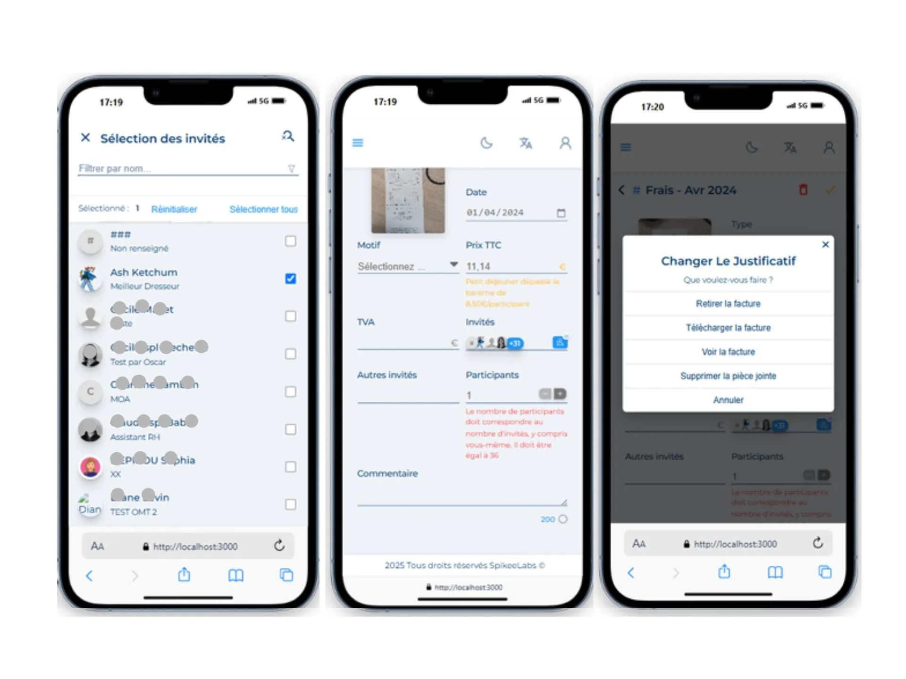
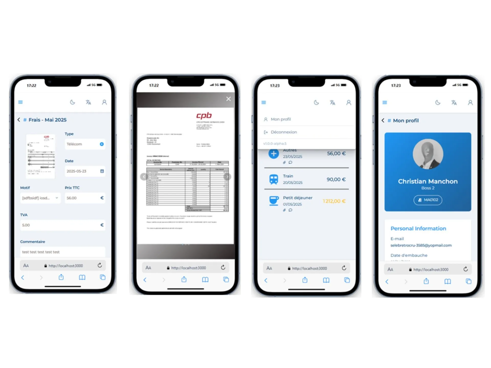
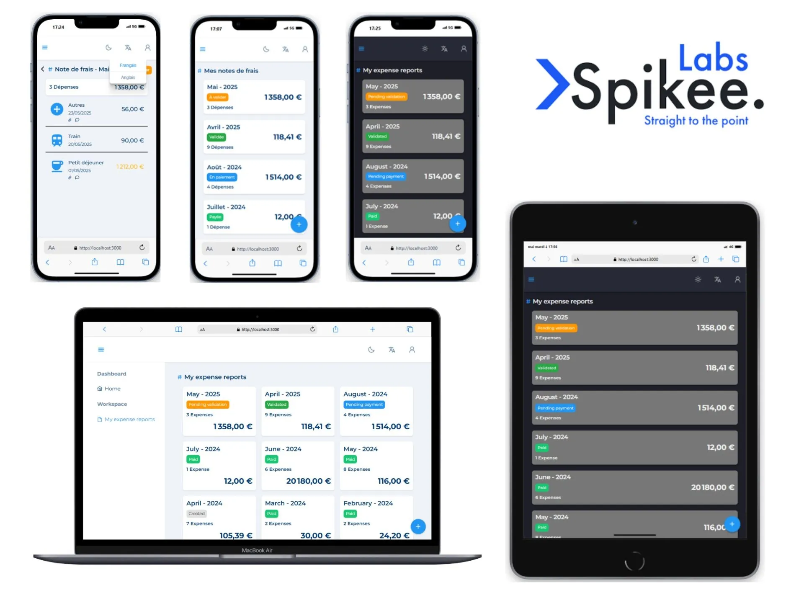

# Mobile Expense & Workforce PWA with OCR Integration

> ⚠️ **Private Project Notice**  
This is a private project developed during a stage at **SpikeeLabs**.  
The source code is **not publicly available**.  
However, you can view the results, demo, and related materials below.

---

## 📽️ Demo Video
- [Watch Demo on YouTube](https://youtu.be/LO-XIZR-TFg)

---

## 📽️ Project Overview  
- [Read Full Project Overview](https://yaakoub-chaker-bteit.web.app/news/mobile-expense-workforce-pwa-with-ocr-integration-zumn09tGNZADlKHZM66S)

---

## 🖼️ Project Preview

  

  

  

    

   

  

  

---

## 📌 Project Overview

This project was developed at **SpikeeLabs** between **March 2025 and September 2025**.  
It focuses on building a modern **Progressive Web Application (PWA)** for mobile expense management, workforce tracking, and automated receipt processing.

The goal was to deliver a **fast, responsive, and cross-platform solution** integrated with enterprise systems.

---

## ✨ Main Functionalities

- **Expense Reimbursement**
  - Create and manage expense reports (notes de frais)
  - Upload and validate receipts via mobile

- **Transport Reimbursement**
  - Request and track transport reimbursements

- **Time Management System**
  - Track working hours and employee schedules

- **Work Timeline & Calendar**
  - Visualize tasks and activities via calendar/timeline UI

---

## 🚀 Project Highlights

- **PWA Architecture**
  - Installable mobile-first application
  - Responsive UI with offline capabilities

- **OCR Integration**
  - Receipt scanning using **Tesseract.js**
  - Automatic data extraction from images

- **Client-Server Architecture**
  - Frontend: React + TypeScript
  - Backend: .NET REST APIs

- **Authentication System**
  - Secure authentication via **Keycloak**

- **Flexible Deployment Strategy**
  - Nginx-based multi-environment deployment
  - Supports `/mobile`, `/test`, `/dev`, `/prod` from a single build

- **Cross-Platform Optimization**
  - iOS / Android / browser compatibility handling

- **Testing Strategy**
  - Unit and integration testing for reliability

---

## 🛠️ Tech Stack

- React.js + TypeScript
- .NET
- PostgreSQL
- Keycloak
- Nginx
- Tesseract.js

---

## 🧠 Notes

This project demonstrates strong expertise in:
- Scalable frontend architecture (React + TypeScript)
- Enterprise backend integration (.NET REST APIs)
- OCR and image processing workflows
- Secure authentication systems (Keycloak)
- PWA deployment strategies for production environments

---

## © 2026 Chaker Yaakoub
All rights reserved.  
Design & development by **Chaker Yaakoub**.
